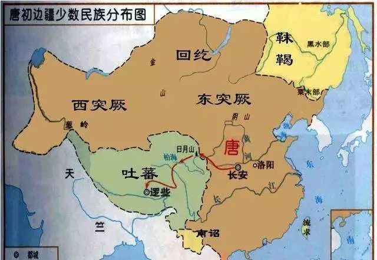
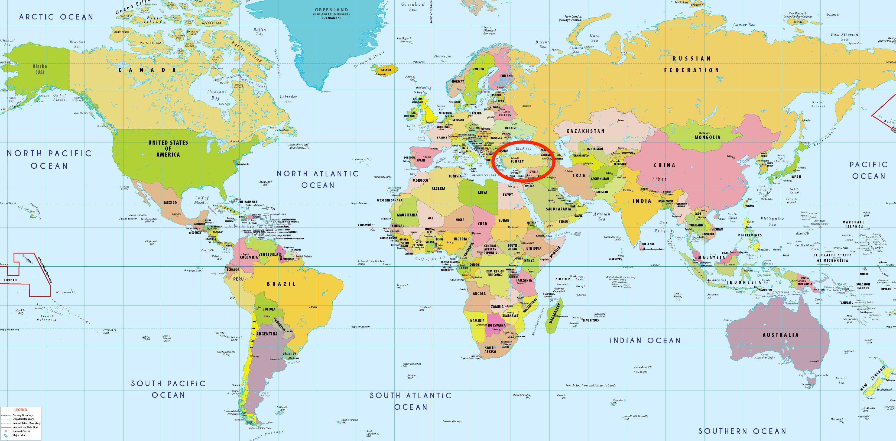
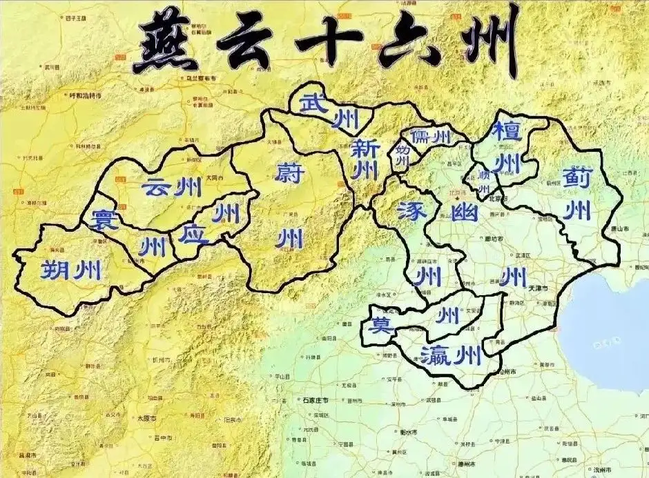
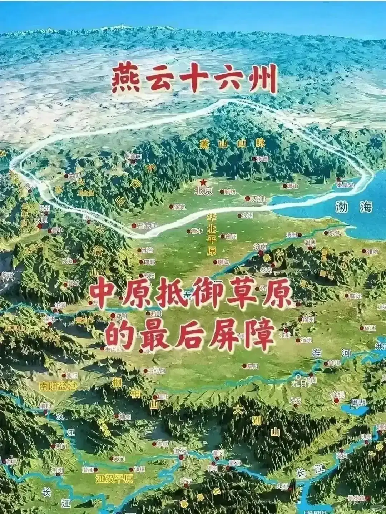
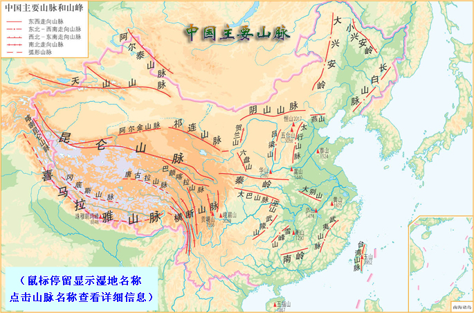
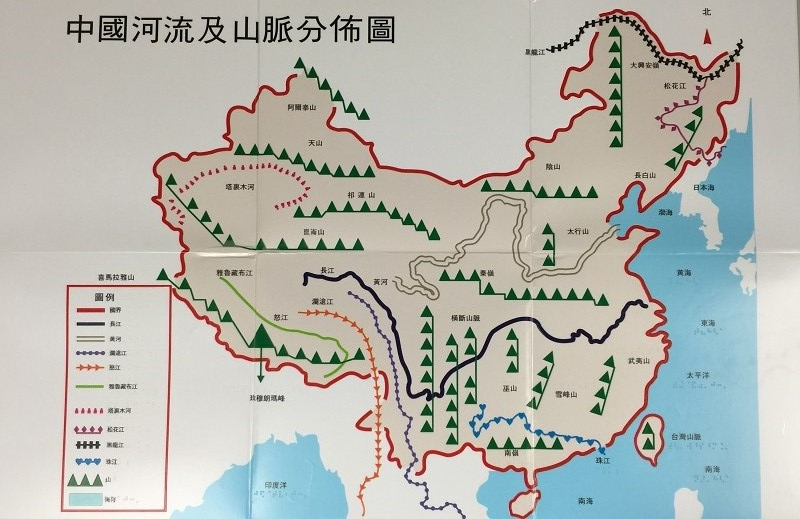
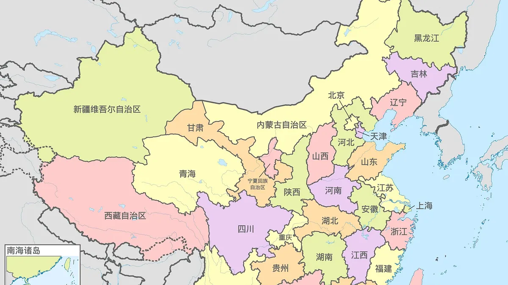

# 族源與國家肇基
> “肇基”：奠定基础；开创基业。肇：开始，创始。基：基础，根基。

## 遼 
公元907年 - 1125年，共218年

### 耶律阿保機（遼太祖）稱可汗
- **時間：** 公元907年

### 契丹囯建立
- **時間：** 公元916年

    **事件：** 耶律·阿保機統一契丹各部，建立契丹囯，定都上京（今内蒙古巴林左旗）。

 

**補充事件1**

公元907年，阿保机刚成为可汗不久，就“伐女直”、“北攻**突厥**”，展示了向北扩张的意图。

>***突厥***
>
>活跃时期：隋唐。
>
>特点与关系：继鲜卑之后，突厥成为蒙古高原的新主人，对新兴的唐朝构成了巨大威胁。唐太宗李世民被称为“天可汗”，就是因为击败了东突厥。后来，突厥帝国在唐朝的打击下瓦解，部分部族西迁，与当地民族融合，是今天土耳其等突厥语族民族的祖先之一。
> 
>古代语境下的“突厥”： 在阿保机和唐宋时期中国人的观念里，“突厥”主要指的就是曾经在蒙古高原建立强大汗国的那个实体（东突厥），以及其后散居在漠北的遗民。

>
>土耳其在世界地圖

**補充事件2**

公元936年，石敬瑭以幽雲十六州爲代價，在契丹扶持下登基稱帝，國號晉，史稱後晉

幽云十六州是指幽、蓟、瀛、莫、涿、檀、顺、新、妫、儒、武、云、应、寰、朔、蔚等十六州。

其他補充地圖

### 大遼建立
- **時間：** 公元938年

    **事件：** 幽雲十六州交割完成，契丹改国号为大辽，将原来的 **幽州**（即燕云十六州的核心）升为陪都，改名为南京析津府 ，又称燕京。

> ***幽州***
>
>**1.核心区域（最稳定的指代）**
>
> 幽州的核心和治所（首府）长期设在蓟城，而这个蓟城就是今天北京市区的西南部，特别是北京西城区和丰台区一带。
>
>**2. 大致范围（以最著名的汉唐时期为例）**
>
>在它范围最广的时期（如东汉、唐代），幽州的管辖面积很大，大致包括今天的：
>
>北京市（全部）
>
>天津市（大部）
>
>河北省北部（如张家口、承德、唐山、秦皇岛、保定北部、廊坊等地）
>
>辽宁省西部（部分地区）
>
>山西省东北部（一小部分）
>
>朝鲜半岛北部（在汉武帝时期曾短暂归属）
>
>可以将其理解为覆盖了燕山山脉南北，囊括了部分华北平原和东北平原西南部的广阔区域。
>
>**3.历史演变**
>
><strong> 先秦时期：</strong> 这里是燕国的所在地，都城在“蓟”。
>
><strong> 汉武帝时期：</strong>设立“十三刺史部”，幽州是其中之一，作为监察区，范围很广。
>
><strong> 东汉至魏晋南北朝：</strong>幽州成为正式的行政区，治所一直在蓟城，是北方的军事、经济中心。
>
><strong> 隋唐时期：</strong>幽州（或称范阳）是防御北方游牧民族（如契丹、奚）的军事重镇，著名的“范阳节度使”安禄山就是从这里起兵发动了“安史之乱”。
>
><strong> 辽宋时期：</strong>后晋皇帝石敬瑭将“燕云十六州”（其中就包括幽州）割让给契丹。辽国在此设立南京析津府，作为其五京之一，又称“燕京”。从此，“幽州”这个名称逐渐被“燕京”等取代。
>
>后续演变：之后的金朝也曾在此建都，名为 中都。到了元朝，忽必烈在此新建都城，命名为 大都，北京从此成为全国的政治中心。

